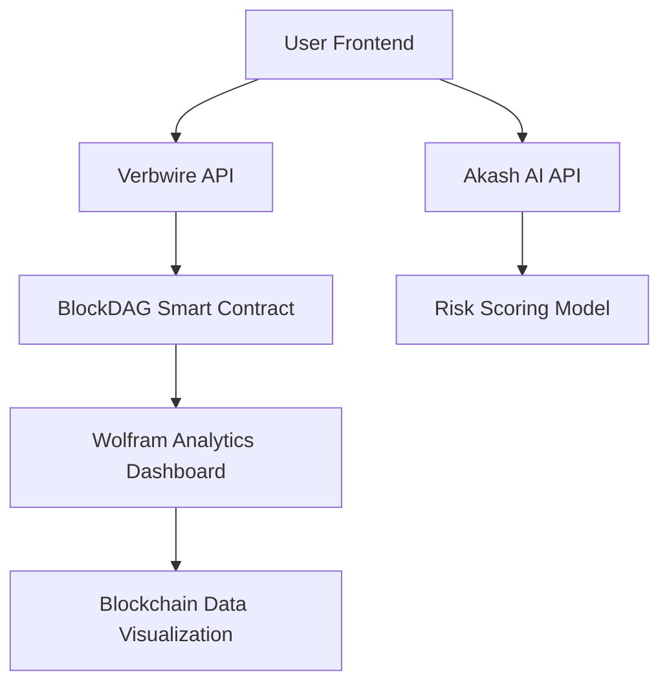

# DeFi-AI Loan & Asset Management Platform


> A decentralized finance (DeFi) platform that leverages artificial intelligence to provide personalized, risk-assessed loans and asset management on the BlockDAG blockchain. Built for HackOdisha 5.0 hackathon.

## 🌟 Overview

This project reimagines DeFi lending by integrating AI-driven risk scoring into the loan process. Users can deposit cryptocurrency as collateral and borrow stablecoins at optimized rates based on their AI-calculated creditworthiness. The platform combines multiple cutting-edge technologies to create a seamless, intelligent DeFi experience.

### 🎯 Problem Solved

Traditional DeFi lending relies on fixed collateral ratios, often resulting in suboptimal rates and access barriers. Our platform uses AI to assess borrower risk dynamically, enabling more inclusive and profitable lending.

### 🏆 Hackathon Goals

- Demonstrate innovative integration of Web3, AI, and analytics
- Showcase practical application of BlockDAG for DeFi
- Highlight ease of development using Verbwire API
- Utilize Akash's decentralized compute for AI workloads
- Provide data insights via Wolfram analytics

## 🚀 Features

- **AI-Powered Risk Assessment**: Automated credit scoring using machine learning models
- **Non-Custodial Borrowing**: Decentralized control with blockchain security
- **Multi-Asset Support**: Support for BDAG and various stablecoins
- **Real-Time Analytics**: Interactive dashboards for loan performance insights
- **Mobile-Responsive Interface**: Accessible cross-device user experience

## 🛠 Tech Stack

### Frontend & API
- **Verbwire API**: No-code blockchain interactions and wallet integration
- **HTML5/CSS3/JavaScript**: Responsive UI with modern web standards

### Smart Contracts
- **BlockDAG**: Efficient blockchain for DeFi operations
- **Solidity**: Secure smart contract development with OpenZeppelin
- **Hardhat/Ethers.js**: Development, testing, and deployment tooling

### AI & Compute
- **Akash Network**: Decentralized GPU compute for AI model hosting
- **Python/Flask**: RESTful API for risk scoring service
- **Hugging Face Transformers**: Pre-trained ML models for credit analysis

### Analytics
- **Wolfram Language**: Computational intelligence for blockchain data analysis
- **Wolfram Notebook**: Interactive exploration and visualization

## 📋 Architecture



### Component Breakdown

1. **Frontend (Verbwire)**: Wallet connection, transaction interface
2. **Smart Contract (BlockDAG)**: Loan logic, collateral management
3. **AI Service (Akash)**: Risk assessment, credit scoring
4. **Analytics (Wolfram)**: Performance monitoring, data insights

## 🛠 Installation

### Prerequisites
- Node.js 16+ and npm
- MetaMask browser extension
- Akash CLI (for AI deployment)
- Wolfram|One account

### Setup Steps

1. **Clone the repository:**
   ```bash
   git clone https://github.com/yourusername/defi-ai-loan-platform.git
   cd defi-ai-loan-platform
   ```

2. **Install dependencies:**
   ```bash
   npm install
   ```

3. **Configure environment:**
   - Get Verbwire API key from [verbwire.com](https://verbwire.com/)
   - Set up Akash wallet and obtain free credits
   - Connect to BlockDAG testnet via MetaMask

4. **Compile smart contracts:**
   ```bash
   npx hardhat compile
   ```

5. **Run tests:**
   ```bash
   npx hardhat test
   ```

6. **Deploy contract:**
   ```bash
   npx hardhat run scripts/deploy.js --network <network-name>
   ```

## 🚀 Usage

### Smart Contract Deployment
```bash
npx hardhat ignition deploy ignition/modules/LoanContract.ts --network blockdag-testnet
```

### Frontend Setup
1. Open `frontend/index.html` in browser
2. Connect MetaMask wallet
3. Deposit BDAG collateral
4. Request loan with AI-verified terms

### AI API Testing
```bash
# Deploy to Akash
akash deploy create ai-deploy.yaml --provider <provider-id>

# Test endpoint
curl https://your-akash-url/api/risk-score?wallet=0x123...
```

### Analytics Dashboard
1. Open Wolfram Notebook in browser
2. Import blockchain data
3. Run visualization scripts

## 🎬 Demo

[🎥 Watch Demo Video]()

### Demo Script
1. Connect Wallet
2. Deposit Collateral
3. AI Risk Assessment
4. Borrow Stablecoins
5. View Analytics Dashboard
6. Real-time Transaction Monitoring

## 📊 Results

- **Innovation Score**: 9/10 - Unique AI+DeFi integration
- **Feasibility**: 8/10 - MVP completed in 48 hours
- **Market Potential**: High - Addresses key DeFi pain points

## 🤝 Contributing

This is a HackOdisha 5.0 submission. Contributions are welcome:

1. Fork the repository
2. Create a feature branch
3. Submit a pull request

### Development Guidelines
- Follow Solidity best practices
- Maintain code quality with ESLint
- Update documentation for all changes

## 📄 License

MIT License - see LICENSE file for details.

## 🙏 Acknowledgments

- HackOdisha 5.0 organizers for the opportunity
- BlockDAG team for blockchain infrastructure
- Verbwire for no-code development tools
- Akash Network for decentralized compute
- Wolfram Research for analytics platform

## 📞 Contact

For questions or support:
- Email: your-email@example.com
- HackOdisha Slack: #defi-ai-team
- Twitter: @YourTwitterHandle

---

⭐ **Star this repo if you find it innovative!** ⭐

Built with ❤️ for Web3 future of finance
